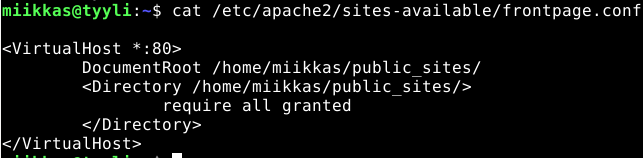
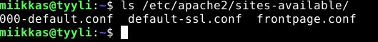
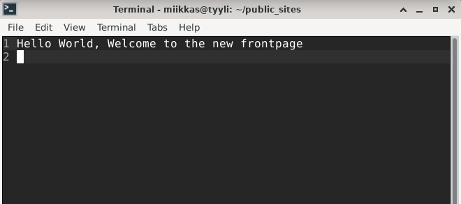
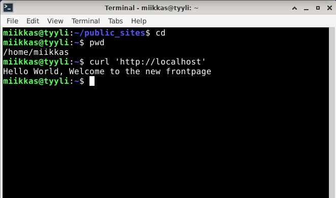
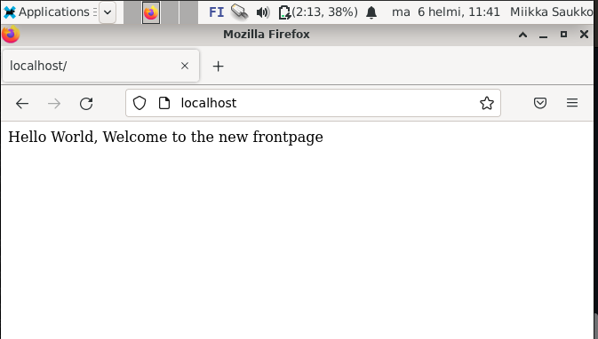
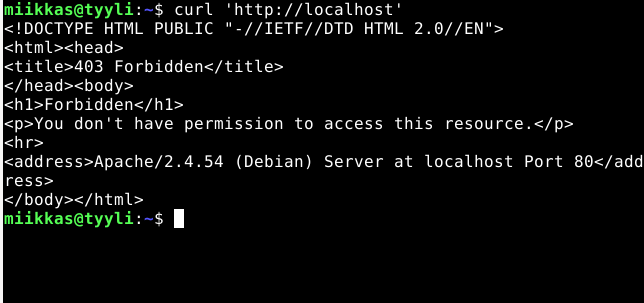
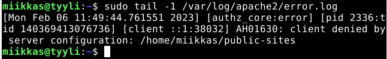
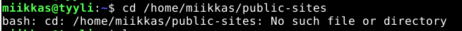
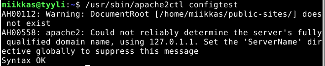

# h6 Tehtävä

x) Lue ja tiivistä. Tiivistelmäksi riittää muutama ranskalainen viiva per artikkeli. (Tässä alakohdassa ei tarvitse tehdä testejä tietokoneella)
Apache Software Foundation 2023: Getting Started
Apache Software Foundation 2023: Name-based Virtual Host Support
a) Vaihda Apachelle uusi etusivu. Varmista, että voit muokata sivua normaalilla käyttäjällä (ilman sudoa).
b) Tee Apachen asetustiedostoon kirjoitusvirhe. Etsi se työkalujen avulla. Vertaa 'apache2ctl configtest' ja virhelokin /var/log/apache2/error.log virheilmoituksia.
n) Vapaaehtoinen: Tee Apachelle kaksi nimipohjaista palvelua (name based virtual host), foo.example.com ja bar.example.com. Voit simuloida nimipalvelun toimintaa hosts-tiedoston avulla.

## x)

## a) 

- Käynnistin apache2 palvelimen komennolla ``$ sudo systemctl start apache2``. Etusivu toimi normaalisti.

- Aloitin uuden etusivun luomisen muokkaamalla uuden tiedoston ``/etc/apache2/sites-available/`` kansioon. Nimesin tiedoston ``frontpage.conf``.
Komento:

    $ sudoedit /etc/apache2/sites-available/frontpage.conf

- ``sudoedit``komennon avulla pääsin muokkamaan suoraan tiedostoa ``micro`` editorilla, jotta palvelin toimii uuden luomani sivun kautta. Kirjoitin sivun tiedostoon tiedostopolun, josta palvelin hakee sivun.

  <VirtualHost *:80>
    DocumentRoot /home/miikkas/public_sites/
    <Directory /home/miikkas/public_sites/>
      require all granted
    </Directory>
  </VirtualHost>

- Otin käyttöön sivuista uuden luomani frontpage.conf sivun. Ensin katsoin saatavilla olevat sivut komennolla ``$ ls /etc/apache2/sites-available/``

- Otin käyttöön uuden sivun komennolla ``$ sudo a2ensite frontpage.conf``.
- Tämän jälkeen otin vanhan etusivun pois käytöstä komennolla ``$ sudo a2dissite 000-default.conf``, jonka jälkeen käynnistin apache2 palvelimen uudelleen komennolla ``$ sudo systemctl restart apache2.service``.

- Siirryin kotihakemistoon tekemään vielä kansion ja html tiedoston sivua varten. Siirryin kotihakemistoon komennolla ``cd`` ja tarkistin polun vielä ``pwd`` komennolla. Tein kansion public_sites komennolla ``$ mkdir public_sites`` ja siirryin kansioon ``$ cd public_sites/``. 
- Tein kansioon ``index.html`` tiedoston, johon kirjoitin simppelin lauseen, joka tulee uudelle etusivulle näkyviin.

Tallensin tiedoston ja menin takaisin kotihakemistoon(``$ cd``) ja testasin uutta etusivua komennolla ``$ curl 'http://localhost``. Palvelin vastasi juuri kirjoittamallani tekstillä, että uusi etusivu toimii.

Testasin vielä verkkoselaimessa:

## b)

Apache2 palvelimen etusivu vastasi seuraavasti.

Lähdin selvittämään vikaa katsomalla ensin apache2:n ``error.log`` komennolla ``$ sudo tail -1 /var/log/apache2/error.log``. Sain error lokista seuraavan vastauksen.

Lokissa näkyi aikaleimalla varusteltu ``error`` tason viesti `` AH01630: client denied by server configuration: /home/miikkas/public-sites``, joka viittaisi vahvasti siihen, että palvelimen konfiguraatio ei onnistunut /home/miikkas/public-sites kautta. 
Kokeilin laittaa komentokehotteeseen kyseisen tiedostopolun:

Niinkuin vastauksesta näkee, komentokehote ei löydä kyseistä tiedostopolkua ``No such file or directory``. Etsin sitten kotihakemistosta kansiota syöttämällä ``cd public`` ja painamalla ``Tab`` näppäintä kahteen kertaan, jolloin komentokehote antoi vaihtoehdoiksi kansiot ``public_html`` ja ``public_sites``. Eli tiedostopolku on kirjoitettu väärin, public_sites kansio oli kirjoitettu väliviivalla alaviivan sijaan. Sen pitäisi olla ``.../public_sites`` eikä ``.../public-sites``

Korjasin virheen, jonka jälkeen etusivu toimi jälleen halutulla tavalla.

Kävin katsomassa myös ``apache2ctl configtest`` tuloksia, josta löytyi:

Mielestäni tätä kautta sai paljon selvemmän kuvan ongelmasta. ``configtest`` tarjosi suoraan, että ``DocumentRoot [/home/miikkas/public-sites/] does not exist, joka kertoo suoraan, että kyseinen teidostopolku ei ole olemassa. Error osoittaa, että vika on selkeästi tiedostopolussa, sillä lopussa lukee ``Syntax OK``, joka kertoo ettei tiedostossa ole kirjoitusvirheitä. 

Molemmat virheilmoitukset antavat virhekoodit, joiden avulla voisi lähteä vikaa myös etsimään. ``configtest`` ei kuitenkaan tarjoa esimerkiksi aikaleimaa, joka auttaa miettimään milloin ja miten virhe olisi voinut tapahtua.
